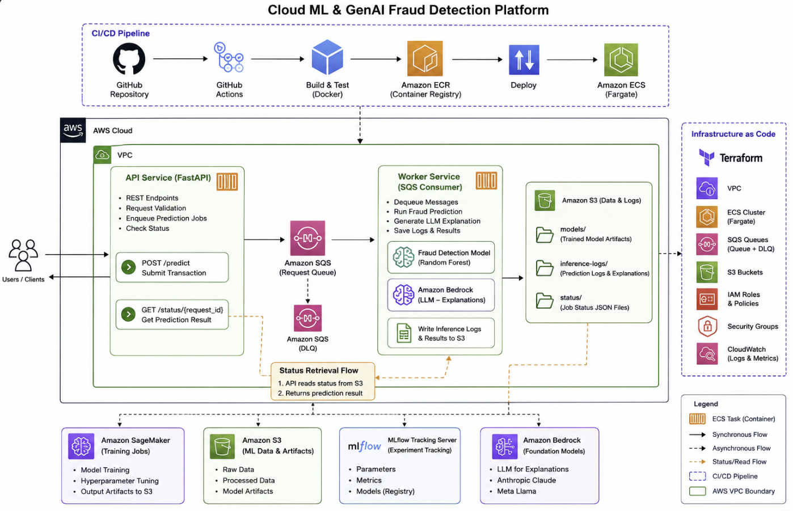
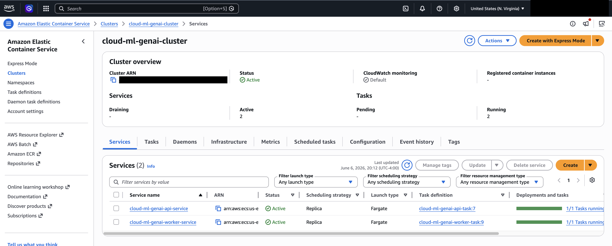

# Project Title - Cloud ML & GenAI Fraud Detection Platform

# Overview

End-to-end cloud-native machine learning platform that trains a fraud detection model on AWS SageMaker and tracks model via MLflow, deploys it using containerized microservices on AWS ECS, processes requests asynchronously using Amazon SQS, enriches predictions with Amazon Bedrock LLM explanations, and manages infrastructure through Terraform and GitHub Actions CI/CD. 
Model training and artifact management were validated using SageMaker and S3.
A SageMaker real-time endpoint was deployed and tested, then removed after validation to minimize AWS costs.

# Architecture



## Architecture Highlights

- FastAPI API service running on ECS Fargate
- Asynchronous processing through Amazon SQS
- Worker-based inference architecture
- Random Forest fraud prediction model
- Amazon Bedrock LLM explanation generation
- S3-based audit logging and status persistence
- Infrastructure provisioned using Terraform
- CI/CD automated with GitHub Actions

# Infrastructure Layer
    +--------------------------------------------------------------+
    |                     Terraform (IaC)                          |
    +--------------------------------------------------------------+
            |              |              |              |
            v              v              v              v

        Amazon S3      Amazon SQS      Amazon ECR      ECS Cluster
            |              |               |               |
            +--------------+---------------+---------------+
                                            |
                                            v
                                    API + Worker Services

                                            |
                                            v
                                    Amazon Bedrock

                                            |
                                            v
                                    SageMaker
                                (Training Workflow)


# Tech Stack

ML

* Scikit-learn
* MLflow
* DVC

API

* FastAPI
* Pydantic

Cloud

* S3
* ECS Fargate
* ECR
* SQS
* Bedrock
* SageMaker

DevOps

* Terraform
* GitHub Actions
* Docker


## Features

* Fraud prediction
* Async processing
* LLM explanations
* S3 audit logging
* DLQ handling
* Infrastructure as Code
* Automated deployment                                


# Local Setup
```bash
git clone ..
docker compose up
```

# Deployment
```bash
cd terraform
terraform apply
```

```bash
git push
```

## Model Performance

| Metric | Value |
|----------|----------|
| Accuracy | 99.97% |
| Precision | 100.00% |
| Recall | 74.55% |
| F1 Score | 85.42% |
| ROC-AUC | 97.52% |

Best model: Random Forest Classifier


## Additional Documentation

| Document | Purpose |
|-----------|----------|
| docs/architecture.png | High-level system architecture |
| docs/Terraform appy.png | Terraform Deployment and Orchestration |
| docs/shutdown.md | Cost-control and shutdown procedures |
| docs/architecture_validation.md | End-to-end architecture validation |
| docs/add_sagemaker_s3_integration.md | SageMaker training and S3 integration |
| docs/add_reliability_monitoring.md | DLQ, monitoring, alarms, and operational hardening |


## Deployment Evidence


## Swagger


## API Validation


## CI/CD Pipeline


## Infrastructure as Code
